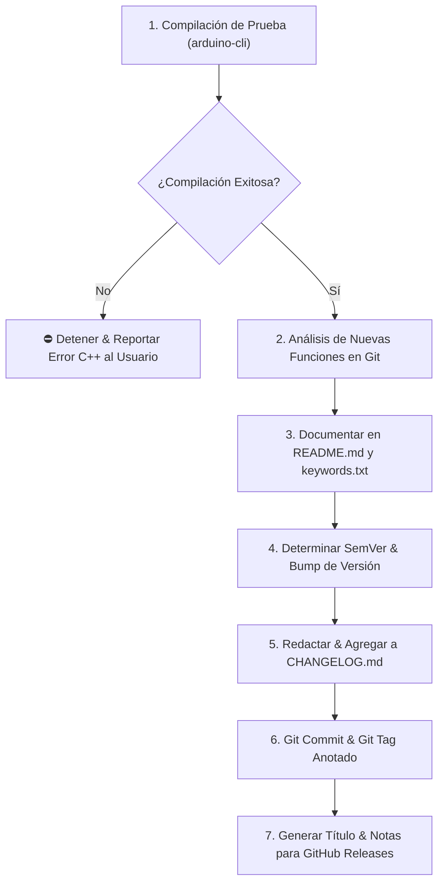

# MicroDB Arduino Library - Protocolo del Agente de Release

Este skill define el procedimiento autónomo estándar para preparar, verificar, versionar y publicar una nueva versión o tag de la **Librería Arduino C++ MicroDB** (`Library-Arduino/MicroDB`).

---

## 🛡️ Principios del Release en MicroDB (Arduino C++)

1. **Cero Tolerancia a Errores de Compilación en C++:** Nunca crear un tag o cambiar la versión si los ejemplos oficiales no compilan limpiamente con `arduino-cli`.
2. **Sincronización Total de Metadatos:** La versión debe coincidir exactamente en:
   - `library.properties` (`version=X.Y.Z`) para el Administrador de Bibliotecas de Arduino.
   - `library.json` (`"version": "X.Y.Z"`) para el registro de PlatformIO.
   - `CHANGELOG.md` (`## [X.Y.Z] - YYYY-MM-DD`).
3. **Resaltado de Sintaxis (Syntax Highlighting):** Toda nueva clase (`KEYWORD1`), método (`KEYWORD2`) o constante (`LITERAL1`) pública debe ser registrada en `keywords.txt` separada por tabulador (`\t`).
4. **Documentación de API y Snippets:** Nuevos métodos deben acompañarse de ejemplos de uso en C++ en `README.md` y en las notas de lanzamiento de GitHub.

---

## 📋 Flujo de Trabajo en 7 Pasos



---

### Paso 1: Verificación de Compilación Inicial

Antes de modificar cualquier archivo de versión, ejecuta:
```bash
node scripts/release.mjs check
```

- Este comando localiza automáticamente `arduino-cli` y compila `examples/QuickStart/QuickStart.ino` contra el núcleo `arduino:avr:uno`.
- Si la compilación falla (exit code !== 0):
  - **DETENER inmediatamente el release.**
  - Identificar la línea y archivo C++ con error de sintaxis o tipo.
  - Ofrecer corregir el error antes de proceder.

---

### Paso 2: Análisis de Nuevas Funcionalidades y Cambios

1. Consulta los commits recientes desde el último tag:
   ```bash
   node scripts/release.mjs status
   ```
2. Analiza los cambios en el código (`git diff` y `git status`):
   - ¿Qué nuevos métodos se añadieron a `MicroDB_Table.h`, `MicroDB_Index.h` o `MicroDB.h`?
   - ¿Qué nuevas estructuras o tipos enum se agregaron en `MicroDB_Types.h`?
   - ¿Qué nuevos flags de configuración o macros se incorporaron en `MicroDB_Config.h`?
   - ¿Se agregaron nuevos ejemplos en la carpeta `examples/`?

---

### Paso 3: Documentación y Registro de Palabras Clave

1. **`keywords.txt`**:
   - Revisa si hay métodos o tipos públicos no registrados ejecutando:
     ```bash
     node scripts/release.mjs keywords
     ```
   - Si se crearon nuevos métodos, añádelos a `keywords.txt` bajo la categoría correspondiente (`KEYWORD1`, `KEYWORD2` o `LITERAL1`) usando siempre caracteres de tabulación (`\t`).
2. **`README.md`**:
   - Documenta los nuevos métodos en la sección de API Reference con su firma en C++, parámetros y un ejemplo mínimo de uso.

---

### Paso 4: Incremento de Versión Semántica (SemVer)

Determina el tipo de incremento:
- **Patch (`x.y.Z`)**: Correcciones de bugs menores, micro-optimizaciones o ajustes en comentarios.
- **Minor (`x.Y.0`)**: Nuevas APIs, métodos de consulta, soporte de tipos o funcionalidades retrocompatibles.
- **Major (`X.0.0`)**: Cambios incompatibles en el encabezado binario de tablas `.tbl`, orden de campos o alteración mayor de la API.

Ejecuta el incremento automático:
```bash
node scripts/release.mjs bump <patch|minor|major|x.y.z>
```
Este comando actualiza simultáneamente:
- `library.properties` (`version=X.Y.Z`)
- `library.json` (`"version": "X.Y.Z"`)

---

### Paso 5: Actualización de `CHANGELOG.md`

Edita `CHANGELOG.md` agregando la nueva sección en la parte superior:

```markdown
## [X.Y.Z] - YYYY-MM-DD

### 🚀 Nuevas Funcionalidades
- **Nombre de la función / método:** Descripción clara y propósito.
  ```cpp
  // Breve snippet de uso
  table.nuevoMetodo(...);
  ```

### 🔧 Optimizaciones y Mejoras
- Mejoras de rendimiento en lectura/escritura SPI, reducción de SRAM o optimizaciones de búfer.

### 🐛 Correcciones
- Solución de problemas reportados en issues o advertencias del compilador.

---
```

---

### Paso 6: Git Commit y Tag Anotado

Crea el commit y el tag de Git:
```bash
node scripts/release.mjs tag <X.Y.Z> "<Título o Resumen de la Versión>"
```
O de forma manual:
```bash
git add library.properties library.json keywords.txt CHANGELOG.md README.md src/ examples/
git commit -m "chore(release): vX.Y.Z - <Resumen de la Versión>"
git tag -a vX.Y.Z -m "Release vX.Y.Z: <Resumen de la Versión>"
```

---

### Paso 7: Generar Título y Notas para GitHub Releases

Ejecuta:
```bash
node scripts/release.mjs notes <X.Y.Z> "<Título del Release>"
```

Entrega al usuario el bloque Markdown formateado listo para copiar y pegar en GitHub Releases:
- **URL destino:** `https://github.com/Library-Arduino/MicroDB/releases/new`
- **Tag:** `vX.Y.Z` | **Rama:** `main`
- **Título del Release:** `MicroDB vX.Y.Z - <Título descriptivo>`
- **Cuerpo en Markdown:** Incluyendo descripción de nuevas funcionalidades, snippets en C++, tabla de plataformas soportadas (ESP32, ESP8266, STM32, AVR, RP2040) y guía de instalación.
- **Comando final para sincronizar:**
  ```bash
  git push origin main --tags
  ```
